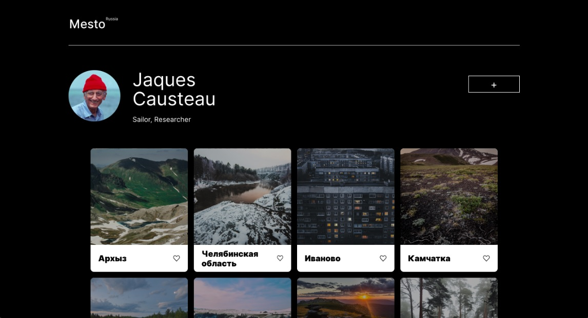

# **sprint-14-authorization**

Version 0.0.3

## About project:
This is a demo-project accomplished to learn basic principles of authorization through the use of Node.js, JWT, bcryptjs and cookies.

## Main functionality: 
- Mesto project allows its users to share favorite photos with their friends, like the most adorable and remove the ones that are not so heart-warming as before.
- You can have a closer look at any photo through just one click.
- Set yourself a memorable nickname and think of what words would best suit to describe who you are and what interests you have. So that other people could know you better and learn what pictures have captured your mind, as well as theirs.

## Technologies used:
ES6, OOP, CSS3, HTML5, Node.js, BEM, MongoDB

## Launch instructions:
- Download or clone the repository
- Install dependencies through npm - `npm i`
- Run `mongod` in command line
- Run the app in development mode - `npm run dev`
- Open you browser and go to http://localhost:3000/ or use Postman to send requests
